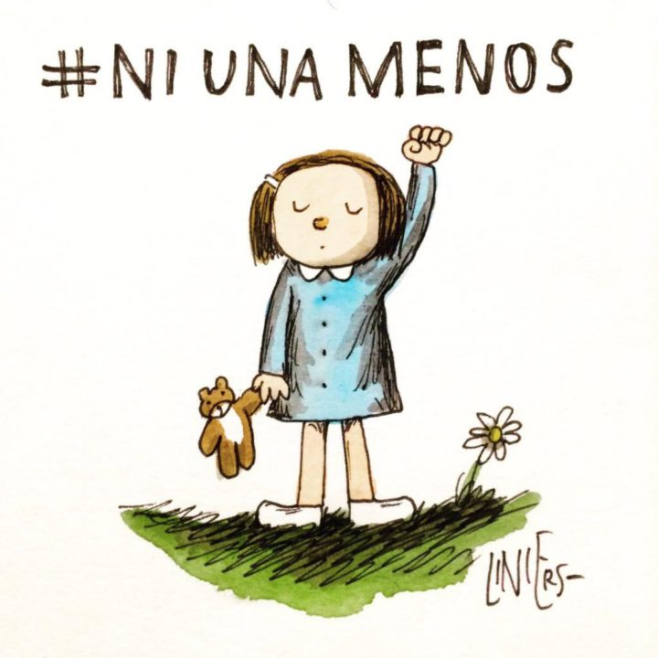

# Ni una menos

## Ejercicio de parcial

**Sistema de seguimiento de denuncias de violencia de género**

### Las agresiones

Se denominan agresiones a los hechos de violencia que sufre una persona. De cada  agresión se conoce el lugar donde fueron hechas, la persona que la efectuó y un conjunto de palabras utilizadas. Si la agresión llegó a un nivel físico se indica además el elemento utilizado. Se quiere saber 

Si una agresión es grave. Si se trata de una agresión común se considera grave cuando entre las palabras usadas hay alguna palabra considerada inaceptable. Para ello se cuenta con un registro único de palabras inaceptables. Si la agresión es física, siempre es grave.

Si una agresión es ígnea, lo cual, en el caso de las agresiones comunes, se valida que entre las palabras usadas esté "fuego". En las fisicas tambien, aunque si el elemento utilizado es un combustible, no es necesario verificar la palabra, ya que de todas maneras se considera que fue con fuego. 

### Las denuncias

Cuando una persona, generalmente una mujer, recibe una agresión, analiza si hace o no una denuncia ante las autoridades, dependiendo de tres requisitos indispensables:

- El primer requisito es que la agresión sea grave. 
- El segundo requisito es que la agresión haya sido hecha por una persona con un vínculo familiar con la víctima. Para ello, se cuenta con la información sobre la composición familiar de una persona.
- El tercer requisito depende de la actitud de la persona frente a la vida y de los antecedentes de agresiones anteriores:

1. Si la persona tiene miedo, nunca hace la denuncia.
2. Si la persona es paciente, mientras sean pocas las agresiones recibidas anteriormente no hace nada, pero cuando llega a una cantidad de agresiones causadas por  la misma persona, que supera cierto umbral de tolerancia, considera hacer la denuncia. 
3. Si la persona es aguerrida, debe haber al menos una agresión previa que sea grave y haya sido hecha por algún familiar, sin importar que sea el mismo que ahora la agrede.
4. Si la persona se considera militante, sólo se validan los dos primeros requisitos. 

Siempre la persona recuerda la agresión recibida. Además, si decide hacer la denuncia, la policía registra cuidadosamente cuál fue la agresión (con su correspondiente victimario) y la víctima. A su vez, le asigna un número correlativo de denuncia.

### Concientización 

Las experiencias que viven las personas hacen que la actitud frente a la vida y en especial su forma de reaccionar frente a la violencia de género vaya cambiando.

- Cuando una persona decide participar de una organización social que defiende los derechos de las víctimas de violencia, se vuelve militante.

- Cuando una persona recibe el acompañamiento cercano de otra persona, asume su misma actitud.  

- Cuando una persona es amenazada de muerte, si es miedosa continúa siéndolo; si es paciente, se duplica su nivel de tolerancia, si es aguerrida se vuelve paciente, con un nivel de tolerancia 5; si es militante, pasa a ser simplemente aguerrida. 

### Se debe presentar:

- El código completo de la definición de los objetos y clases necesarios para los ítems pedidos.
- Un test que valide que al recibir una agresión la persona realice la denuncia. Elegir un caso sencillo.
- Una explicación acerca de la utilidad del polimorfismo en la solución.
- Justificar: Hay alguna situación que amerite lanzar una excepción?
